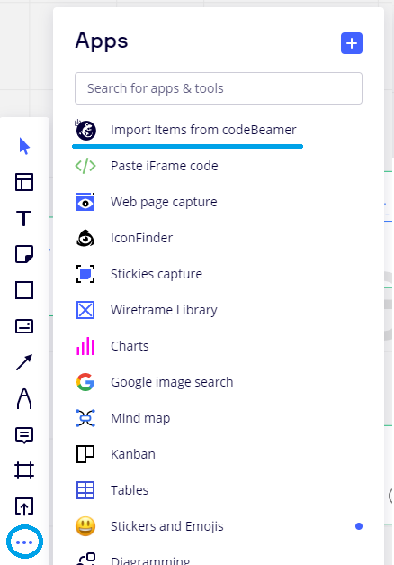
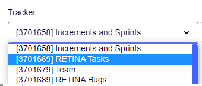
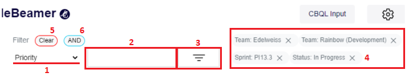
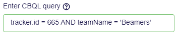
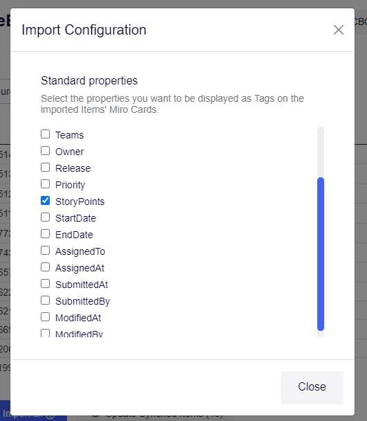

<h1 align="center">
  codebeamer-miro
   
</h1>

  <a href="https://github.com/codeBeamer-Extensions-and-Addons/codebeamer-miro/tree/refactor/react#installation">Installation</a> |
  <a href="https://github.com/codeBeamer-Extensions-and-Addons/codebeamer-miro/blob/refactor/react/CHANGELOG.md">Changelog</a>

<h3 align="center">Visualize your codeBeamer issues in Miro</h3>

    This is a Plugin for <a href="https://miro.com">Miro</a> that allows you to sync Issues managed on a <a href="https://codebeamer.com">codeBeamer</a> instance,   visualizing them as App Cards on your boards.

--readme not up to date yet

# Installation

We're not yet on the Miro Marketplace, so in order to get your hands on the plugin, it must be installed with a workaround.

If one of your peers has already installed the app in their team, they can provide you with an installation-link to then use that installation in any of your teams. Just ask them for the Installation URL. Clicking on it will take you to Miro, where you can then select a Team to enable the app on.

## Host the app (advanced)

To host the app yourself (, which is necessary if you don't have an Installation URL), you can follow steps **two** to **four** of the [Miro Developer Getting started Guide](https://developers.miro.com/docs/getting-started) to install the app on your team.  
Make sure to copy the link to this repository's [Github-Pages](https://codebeamer-extensions-and-addons.github.io/codebeamer-miro/), where we host the plugin, and paste it in the URL field under **App URL** in your app settings.

Installing the app on your team will also give you an Installation URL to share the app with (see point five of the mentioned guide).

# Features

## Abstract

The plugin allows you to connect to a specific codeBeamer instance with your codeBeamer credentials. This can be done via the [Plugin Widget](#plugin-widget).
Once connected, you can open the [Import page](#import-page) to query items in a project, by selecting a Tracker and optionally specifying filter criteria. Advanced users can also query items directly with CBQL.  
These items can then be imported into Miro, which will result in Card Widgets that display some of the items' properties and relations between them.

## Plugin settings

### Plugin widget

Once installed, the plugin will create the below widget in your board. This widget contains some basic information and allows opening the [Settings Page](#Settings-Page) with the codeBeamer-Button in it's toolbar.  
_If the widget is deleted, it will be regenerated when reloading the page, as long as the plugin is loaded._

### Settings Page

The basic settings consist of `Project`- and `Authentication` settings. The project settings specify a codeBeamer address in which you can then specify a project to afterwards access it's trackers and import items from.  
The `Inbox Tracker ID` serves as inbox/dump for cb-items created in Miro. More about that [here](#Create-cb-items-from-miro-widgets)

#### Credentials/Security

The credentials you enter in the Settings Page are your credentials for the specified codeBeamer instance. In order to improve UX, the credentials are stored **_in plaintext_** within your browser's _session storage_ to reuse them in subsequent requests to the codeBeamer API. Session storage is wiped when you close the browser window or the browser itself. So your credentials won't just lie around for an uncontrolled amount of time.  
But; preferably don't open your session storage whenever you're presenting your screen.

## Import Page

### Accessing the Page

Once your settings are okay, the plugin's Import Page can be opened via its button in the Miro sidebar.
By default, you'll find it under "Apps", which you can get to by clicking the three dots at the bottom of the bar. Feel free to drag & drop it into the sidebar for quick access.

### Using the Page

The Import Page gives access to the app's main functionality; Importing items from your codeBeamer instance onto the Miro board as Cards.

#### Query Items

In order to query items you can either use the [regular search](#regular-search), which provides you with dropdowns and inputs to specify specific filter criteria or, if you're familiar with the [CQBL](https://codebeamer.com/cb/wiki/871101), you can also specify the exact query you want to make with a CodeBeamer Query Language string in the [advanced search](#Advanced-Search).

##### Regular Search

First, select a tracker within the specified project from the dropdown.

This will query for all Items in the selected Tracker. To narrow them further down, these Items can be filtered by virtually any property; The standard properties are _Team_, _Release_ and _Subject_, but the dropdown to select your criteria type from (1) will allow to choose from all of the selected Tracker's properties.

Image legend
1. Select a property to filter by
2. Enter the property's value  
Mind that this value must *exactly* correspond to the property's (text-)value for the query to work.
3. Add the specified filter by clicking this button
4. Your added criteria appear as chips to the right.  
You can remove them individually here by clicking on their X-Button
5. This button allows removing all specified filter criteria with a single click.
6. This button allows to toggle between linking the specified criteria with AND or OR.  
E.g. imagine you specified two teams, "Edelweiss" and "Margarite" as filters, this allows you to either filter for Itmes that have both "Edelweiss" *and* "Margarite" assigned (AND / intersection of the result sets) or Items that have either Team "Edelweiss" *or* Team "Margarite" assigned (OR / union of the result sets).

##### Advanced Search

The advanced search is destined for users familiar with [CBQL](https://codebeamer.com/cb/wiki/871101) and gives them full control on their queries. Just enter your query string to run it.

#### Import

**All imported items are read-only. Mastery of their data is in codeBeamer.**

Queried Items can be selected imported either by selecting them _individually (1)_ and then importing them, or they can be _bulk-imported (2)_.  
The bulk-import will import all items matching the current criteria, also those not loaded into the table. You'll be warned if there's more than 20 of them, since this can take substantial time (20 items will be imported in about 10 seconds, the time it takes grows proportionally to the amount of items).

Importing will generate a Miro Card Widget for each of the items. These will by default contain:

-   The item's **Title** as the card's title (containing the link to the issue on codeBeamer)
-   The item's **Description** as the card's description
-   The item's **Status** as a badge

Additionally, if the card has _upstream references_ or _outgoing relations_, these will be rendered by a uni-directional line. Associations are rendered as "dashed" lines and the [nine association types](https://codebeamer.com/cb/wiki/31276#section-Associations) each have their own color. Other relations are visualized as black lines.

| Type                         | Color                |
| ---------------------------- | -------------------- |
| depends on                   | Red - #FF1500        |
| is superordinate to (parent) | Green - #008c00      |
| is subordinate to (child)    | Orange - #FFA500     |
| is related to                | Blue - #0066CC       |
| is derived from              | Lightblue - #ADD8E8  |
| copy of                      | Darkblue - #00008b   |
| violates                     | Darkyellow - #c9b00e |
| excludes                     | Magenta - #FF00FF    |
| invalidates                  | Violet - #7100FF     |

##### Import Configuration

Via the "Settings" button on the top right of the Page, you can open a modal where you can configure import behaviour.  
Currently, the only configuration option available is selecting what properties you want to be imported and displayed on the resulting Miro Cards as Badges/Tags.  
Mind that this list of properties is currently static. Choosing a Tracker with a different configuration won't change it.

Just check a property and the next time you import / update items, the respective property should be loaded. Mind that due to the fully configurable nature of codeBeamer Trackers, some Items might not display the expected values.

### Update synchronized Items

Since data of cards based on a codeBeamer item are read-only and can therefore not be changed in Miro, you have to do so in codeBeamer itself.  
Any changes made in codeBeamer can then be synchronized to the Miro board via the `Update Synched Items (y)` button on the _Import from codeBeamer_ modal.

Clicking the button updates the data (relations included) of **all** codeBeamer-originating widgets on the board, so mind that it can take its time. *There's currently no way of updating only a select amount of items.*

## Sync from miro to codeBeamer

The plugin supports _creating_ codeBeamer items based on a Miro widget.
Any widget can be "converted to a cb item" by clicking the respective button in it's toolbar.

Consider that:

-   Only **title** and **description** fields will be considered.
-   The widget will be converted to a card and become read-only.
-   The cb item will be created within the `Inbox Tracker ID` specified in the [plugin settings](#Config-Widget).

# Contribute

Anyone can contribute. Just branch off of `develop` and create a Pull request when your feature is ready. If you want to propose a feature or report a bug instead, feel free to create an [Issue](https://github.com/codeBeamer-Extensions-and-Addons/codebeamer-miro/issues).

## Local setup (deprecated)

### Setup

Run `npm install` in the root directory of the repository to install all dependencies

### Build

Run `npm run build` (on Windows) or `npm run build-linux` depending on your OS.\
Afterward, you can run `npm run watch` to continuously watch the TS files for changes and autocompile on save.

### Host locally and use on Miro

To run on Miro, you will need to host the contents of the **dist** directory via HTTP**S**. This can be achieved by running it on http locally and then tunneling to it using ngrok.

Run `npm run start` in a separate terminal to start a local http server on port 8081 \
Run `npm run ngrok` in yet another terminal (the third terminal :) ) to get an ngrok address that points to your localhost. Only you will be able to browse this.

Now you can set the address of your dev environment miro-plugin to the temporary ngrok address. \
To develop and see the changes directly on Miro, have one terminal watch the code using the watch command above. After saving a script, Ctrl+F5 the ngrok address in a browser to force it to reload it (Miro will not do this very often). Now refresh Miro and voila.

If you make a change to any of the html files, you will need to stop the http server (to release the dist folder), rerun the build process (it will rebuild the dist folder) and start the http server back up. I have observed that sometimes, you need to manually clear the browser cache completely for Miro to notice the change.

