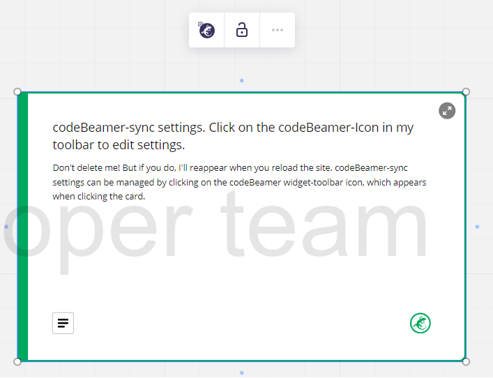
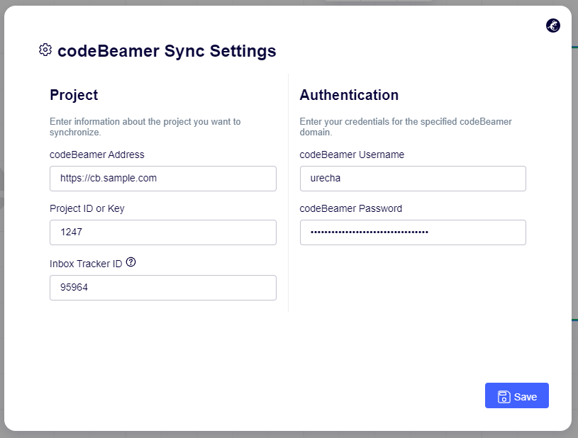
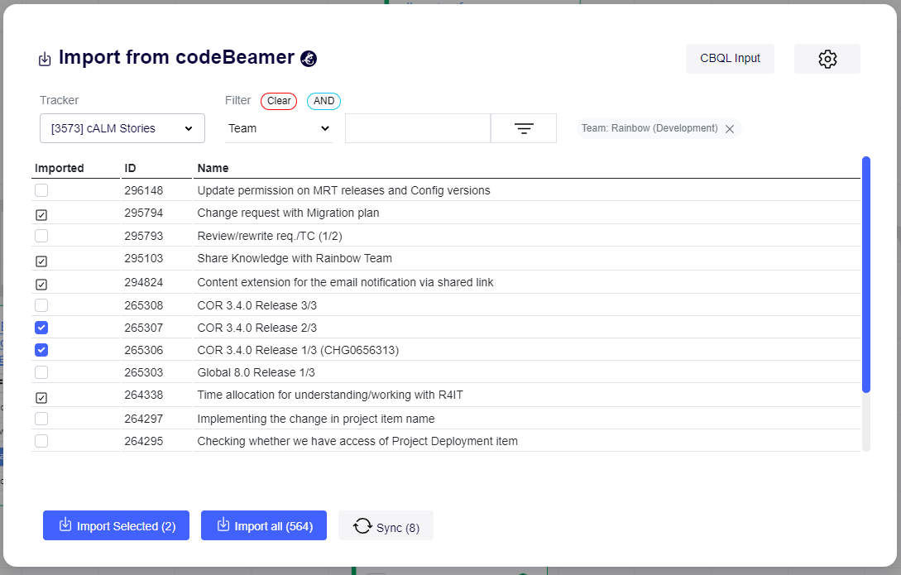
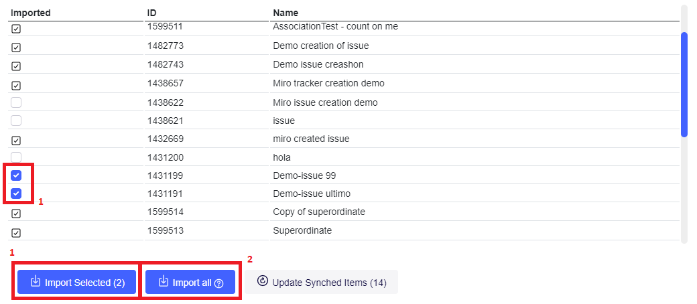
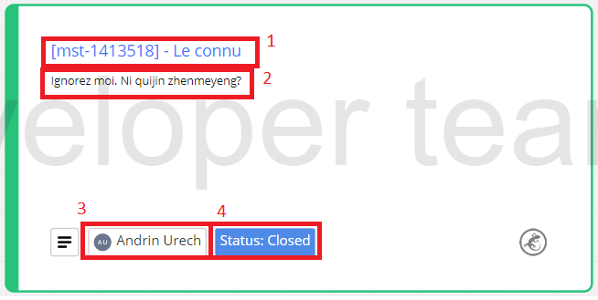
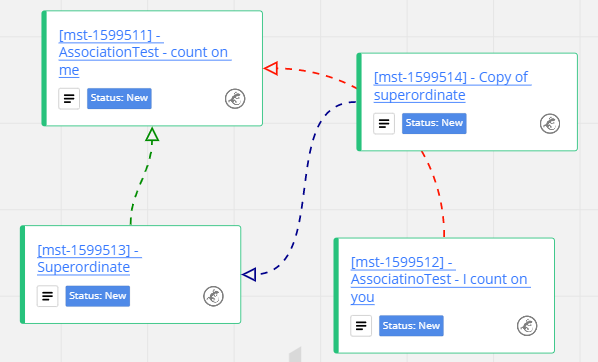
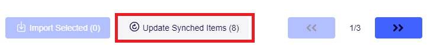
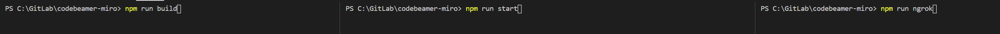
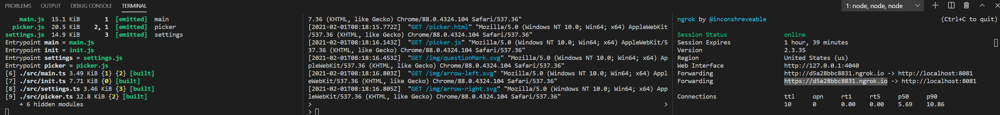

# Miro plugin: codeBeamer integration

This is a [codeBeamer](https://codebeamer.com/) <-> [Miro](https://miro.com/) integration web-plugin for Miro.
It's main goal is to automate and therefore greatly speed up the process of mirroring codeBeamer items in Miro for planning/visualization purposes.

According to it's creator;
> The goal is to make this plugin at least as powerful as the [Miro-Jira plugin](https://miro.com/works-with-atlassian/)

# Features

## Config Widget

Once installed, the plugin will create the above widget in your board. This widget provides access to the plugin settings via a button in it's toolbar. *If the widget is deleted, it will be regenerated when reloading the page, as long as the plugin's loaded.*

The settings comprise of `Project`- and `Authentication` settings. The project settings specify a codeBeamer address in which you can then specify a project to afterwards access it's trackers and import items from.  
The `Inbox Tracker ID` serves as a inbox/dump for cb-items created in Miro. More about that [here](@Create-cb-items-from-miro-widgets)

### Credentials/Security

*Subject to change / Discussion in progress*

The credentials you use here are your credentials for the specified codeBeamer instance. When you save the settings, the plugin will attempt to get your user informations from the latter using **Basic** authentication over **HTTPS** to verify them. Additionally, in order to improve UX, the credentials are stored **_in plaintext_** within your browser's *session storage* to reuse them in subsequent requests to the codeBeamer API.

## Sync from codeBeamer to miro

The "picker" modal can be opened via its respective button in the left board-toolbar, once a functional set of settings has been configured.  

### Import

The modal allows for selecting a tracker within the specified project from the dropdown. If there are any items under this tracker, they will be displayed in a table below. The table is paginated and holds up to thirteen items per page.  

Items can be selected either *individually* (1), *per-page* (2) or *per-tracker* (3).

After selecting the items you wish to import from this page, clicking on the `Import selected (x)` button will get information about the items from the specified codeBeamer instance and create a card-widget containing following information: 
1. The item's **Title** as the card's title (containing the link to the issue on cb)
2. The item's **Description** as the card's description
3. The person the item is **assigned to** as a badge
4. The item's **Status** as a badge

If the card has *upstream references* or *outgoing relations*, these will be rendered by a uni-directional line: 

**All imported items are read-only. Mastery of their data is in codeBeamer.**

#### CBQL queries

Users proficient in CBQL can switch to a CBQL query input on the *Import from codeBeamer* window as an alternative to the tracker selection to conduct more specific queries.

### Update

Since data of cards based on a codeBeamer item are read-only and can therefore not be changed in Miro, you have to do so in codeBeamer itself.  
Any changes made in codeBeamer can then be synchronized to the Miro board via the `Update Synched Items (y)` button on the *Import from codeBeamer* modal. 

Clicking the button updates the data (relations included) of *all* codeBeamer-originating widgets on the board.

## Sync from miro to codeBeamer

The plugin supports *creating* codeBeamer items based on a Miro widget. 
Any widget can be "converted to a cb item" by clicking the respective button in it's toolbar.

Consider that:
- Only **title** and **description** fields will be considered.
- The widget will be converted to a card and become read-only.
- The cb item will be created within the `Inbox Tracker ID` specified in the [plugin settings](#Config-Widget).

# Build and Run locally
## Setup
Run `npm install` in the root directory of the repository to install all dependencies

## Build
Run `npm run build` (on Windows) or `npm run build-linux` depending on your OS.\
Afterward, you can run `npm run watch` to continuously watch the TS files for changes and autocompile on save.

## Host locally and use on Miro
To run on Miro, you will need to host the contents of the **dist** directory via HTTP**S**. This can be achieved by running it on http locally and then tunneling to it using ngrok.

Run `npm run start` in a separate terminal to start a local http server on port 8081 \
Run `npm run ngrok` in yet another terminal (the third terminal :) ) to get an ngrok address that points to your localhost. Only you will be able to browse this.

Now you can set the address of your dev environment miro-plugin to the temporary ngrok address. \
To develop and see the changes directly on Miro, have one terminal watch the code using the watch command above. After saving a script, Ctrl+F5 the ngrok address in a browser to force it to reload it (Miro will not do this very often). Now refresh Miro and voila.

If you make a change to any of the html files, you will need to stop the http server (to release the dist folder), rerun the build process (it will rebuild the dist folder) and start the http server back up. I have observed that sometimes, you need to manually clear the browser cache completely for Miro to notice the change.

# Contribute
You can simply create a branch, make your changes and submit a pull request to master.

# How to Install and Use
We are not yet on the Miro Marketplace - we will submit once we are happy with the state of the project \
To install, follow steps 2,3 and 4 of the [Miro Developer Getting started Guide](https://developers.miro.com/docs/getting-started) \
Copy the [link of the Github-Pages page of this repo](https://max-poprawe.github.io/codebeamer-miro/) and paste it in the URL field under `Web-plugin` in your app settings.