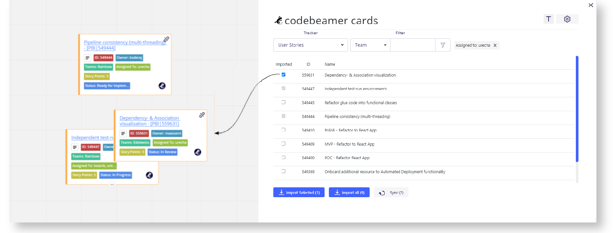

<p align="center">
   
</p>

<p align="center">
  <a href="https://github.com/codeBeamer-Extensions-and-Addons/codebeamer-miro/blob/refactor/react#installation">Installation</a> |
  <a href="https://github.com/codeBeamer-Extensions-and-Addons/codebeamer-miro/blob/refactor/react/CHANGELOG.md">Changelog</a>
</p>

<h3 align="center">Visualize your codeBeamer issues in Miro</h3>

<p align="center">
    This is a Plugin for <a href="https://miro.com">Miro</a> that allows you to sync Issues managed on a <a href="https://codebeamer.com">codeBeamer</a> instance, <br/> visualizing them as App Cards on your boards.
</p>

<p align="center">
<a href="[https://www.npmjs.com/package/cypress](https://dashboard.cypress.io/projects/cumqrv/runs)">
    
 </a>
</p>

---

# Features

The App is entirely focused around the functionality to:

-   **Import codebeamer Items into Miro and visualize them as AppCards**

<div align="center">

</div>

This is enabled further by:

-   **Support for self-hosted instances**
    -   Connect to any codebeamer instance
-   **Filtering Items**
    -   Select any Project, then
    -   Filter Items by a Tracker and
        -   Filter by any of the Tracker's fields with a codebeamer-like interface
-   **Configure AppCards**
    -   Configure what data the AppCards display

<div align="center">

</div>

-   **Editing planning-relevant attributes right on the board**
    -   Edit a select few attributes like "Version" or "Team" in Miro.

<div align="center">

</div>

-   **Relation visualization**
    -   see associations and hierarchical relations between your Items visualized with differently styled connectors

<div align="center">

</div>

Want to give it a shot? [Install](#installation) the app, then click the  Salamander in the left Toolbar (initially hidden under `>>`) on Miro.

<!--
* Less might very well be more here.
* Why bother making a long and intricate manual? Just make the app a good UX and self-explanatory.
 -->

### Relation Color Table

The connectors that visualize relations between Items are colored as follows:

| Type                         | Color                                                     |
| ---------------------------- | --------------------------------------------------------- |
| depends on                   | <span style="color: #FF1500;">Red - #FF1500</span>        |
| is superordinate to (parent) | <span style="color: #008c00;">Green - #008c00</span>      |
| is subordinate to (child)    | <span style="color: #FFA500;">Orange - #FFA500</span>     |
| is related to                | <span style="color: #0066CC;">Blue - #0066CC</span>       |
| is derived from              | <span style="color: #ADD8E8;">Lightblue - #ADD8E8</span>  |
| copy of                      | <span style="color: #00008b;">Darkblue - #00008b</span>   |
| violates                     | <span style="color: #c9b00e;">Darkyellow - #c9b00e</span> |
| excludes                     | <span style="color: #FF00FF;">Magenta - #FF00FF</span>    |
| invalidates                  | <span style="color: #7100FF;">Violet - #7100FF</span>     |

# Installation

The app is not (yet) available on the Miro Marketplace, so you'll have to install it in your Team directly.

If a peer of yours has already installed the app in their team, they can provide you with an link for using that installation. Just ask them for the `Installation URL`. Opening it will take you to Miro, where you can then select a Team to enable the app on.

In order to install the App on your Team directly, follow steps **two** to **four** of the [Miro Developer Getting started Guide](https://developers.miro.com/docs/getting-started).  
Make sure to copy the link to this repository's [Github-Pages](https://codebeamer-extensions-and-addons.github.io/codebeamer-miro/), where we host the plugin, and paste it in the URL field under **App URL** in your app settings.

Installing the app on your team will also give you an Installation URL to share the app with (see point five of the mentioned guide).

# Contribute

Anyone can contribute. Just branch off of `develop` and create a Pull request when your feature is ready.  
If you want to propose a feature or report a bug instead, feel free to create an [Issue](https://github.com/codeBeamer-Extensions-and-Addons/codebeamer-miro/issues).

## Tech Stack

-   The app is written in TypeScript and uses the [React](https://reactjs.org/) UI Framework.
-   Tests are [Cypress](https://cypress.io) Component tests written in TypeScript.

## Local setup

### Setup

```bat
npm i                   // install dependencies
npm run build           // build the app with vite
npm run start           // run the development server on localhost 3000 (if available)
```

To use the locally hosted app on Miro, follow Steps 2 to 4 on [Miro's Guide](https://developers.miro.com/docs/build-your-first-hello-world-app).
